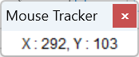

<div align="center">

#  MouseTracker

#### 让捕获屏幕坐标更简单 Make Capturing Screen Position Easier

---

</div>

实时显示鼠标坐标位置的极简Win32窗体应用，基于C++实现，适用于Windows 10以上系统，生成的exe文件最小只有18KB。

---


坐标为鼠标所在位置相对于显示屏分辨率的XY坐标值，左上角为(0,0)，右下角为显示屏分辨率，坐标每50ms更新，窗体显示在最上方，显示效果如下：




## How to compile GCC编译命令(GCC需自行安装)：

```powershell
windres -i "icon.rc" -o "icon.o"

x86_64-w64-mingw32-g++.exe -Os -s -mwindows -lgdi32 -fno-exceptions -fno-rtti -fno-threadsafe-statics -ffunction-sections -fdata-sections -Wl,--gc-sections -flto MouseTracker.cpp icon.o -o MouseTracker.exe
```

或者

```powershell
windres -i "icon.rc" -o "icon.o"

g++.exe -Os -s -mwindows -lgdi32 -fno-exceptions -fno-rtti -fno-threadsafe-statics -ffunction-sections -fdata-sections -Wl,--gc-sections -flto MouseTracker.cpp icon.o -o MouseTracker.exe
```

## License

This project is open source under the MIT license. Welcome everyone to use and contribute code. Thank you for the open source spirit of the original author ikiwi.

[MIT](https://opensource.org/licenses/MIT)

Copyright (c) 2024 ikiwi